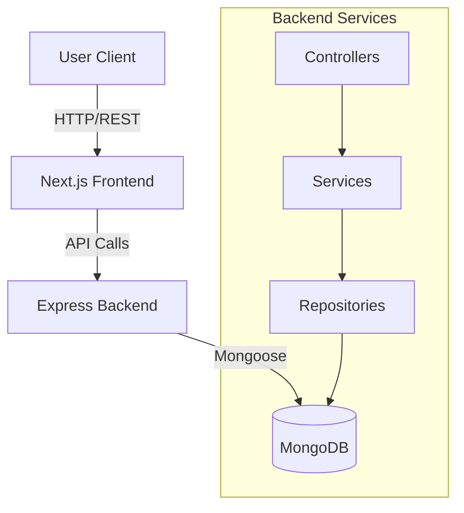
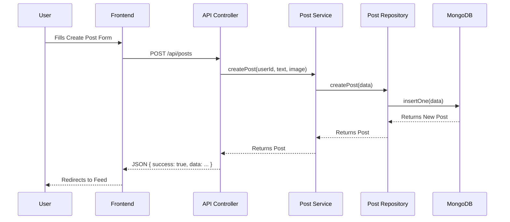

# System Architecture

## Architecture Diagram

```mermaid
graph TD
    User[User Client] -->|HTTP/REST| Frontend[Next.js Frontend]
    Frontend -->|API Calls| Backend[Express Backend]
    Backend -->|Mongoose| DB[(MongoDB)]
    
    subgraph Backend Services
        Controller[Controllers]
        Service[Services]
        Repo[Repositories]
        
        Controller --> Service
        Service --> Repo
        Repo --> DB
    end
```

## CRUD Flow Chart (Create Post)

```mermaid
sequenceDiagram
    participant U as User
    participant F as Frontend
    participant A as API Controller
    participant S as Post Service
    participant R as Post Repository
    participant D as MongoDB

    U->>F: Fills Create Post Form
    F->>A: POST /api/posts
    A->>S: createPost(userId, text, image)
    S->>R: createPost(data)
    R->>D: insertOne(data)
    D-->>R: Returns New Post
    R-->>S: Returns Post
    S-->>A: Returns Post
    A-->>F: JSON { success: true, data: ... }
    F-->>U: Redirects to Feed
```
